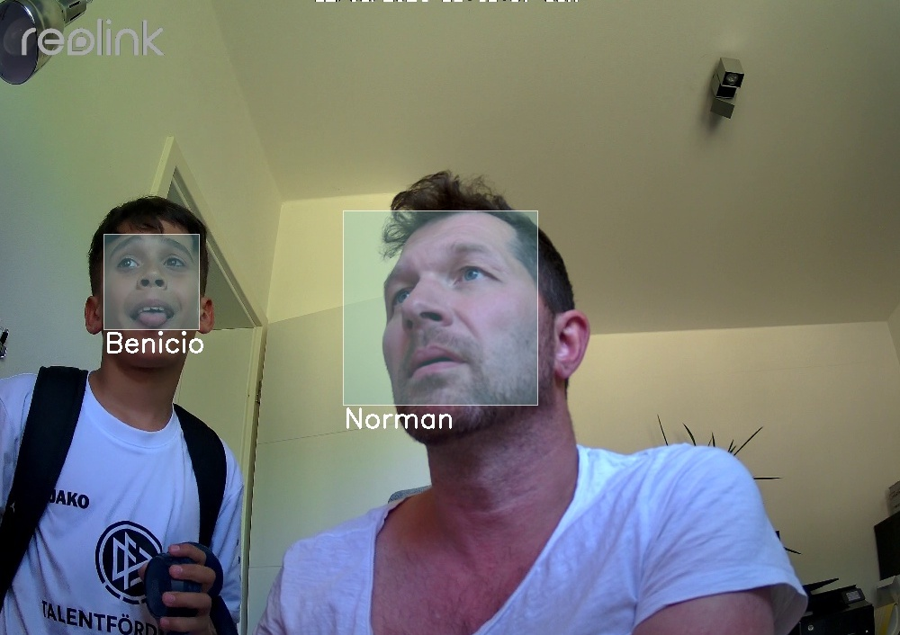
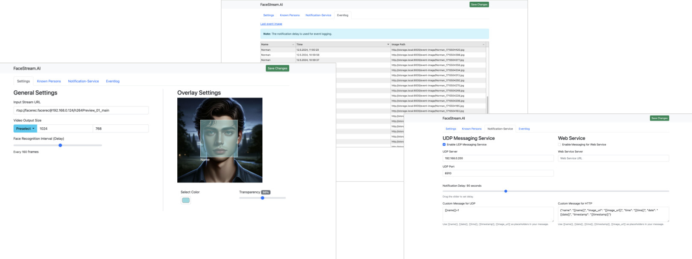

<p align="center"><em>Face Recognition in Live Video</em></p>
<h1 align="center">FaceStream.AI</h1>



### Features
* Real-time video streaming with face recognition: Recognize faces in live video and serves a stream with rectangle rendering ``<your-host>:<5001>/stream``
* Easy configuration with web interface with upload feature of known faces ``<your-host>:<5000>``
* Eventlog with safed image if a face is recognized, viewable in web interface
* configurable UDP/HTTP *Notification Service* for detected faces to notify other services 



## Fast and lightweight for dockerized setups
* you can adjust the face recognition interval for your needs (default is every 60 frames)
* uses high performant face detection AI models

# Installation Guide for FaceStream.AI

This guide provides instructions on how to build and run the Docker image for FaceStream.AI from the GitHub repository.

## Prerequisites

Before you begin, make sure you have the following installed:
- [Git](https://git-scm.com/downloads)
- [Docker](https://docs.docker.com/get-docker/)

## Cloning the Repository

First, clone the FaceStream.AI repository to your local machine using the following command:

```bash
git clone https://github.com/norman-albusberger/FaceStream.AI.git
```

## Building the Docker Image

Navigate to the cloned repository directory:

```bash
cd FaceStream.AI
```

Build the Docker image using the following command. Replace `facestream-ai` with your preferred image name:

```bash
docker build -t facestream-ai .
```

## Running the Docker Image

After the image has been successfully built, you can run it with the following command. Adjust the port mappings as necessary based on the application's requirements:

```bash
docker run -p 5000:5000 -p 5001:5001 -v data:/data facestream-ai
```
Map the ports to your needs. The configuration data, known faces, event log and event images are stored in /data. You could map it to any volume you like.

## Verifying the Installation

After running the Docker image, you can verify that the web interface is up and running by accessing it through your browser:

```
http://localhost:5000
```
Wenn your input stream is reachable you can access the output stream on:

```
http://localhost:5001/stream
```

Replace `localhost` with your Docker host IP if necessary.

## Additional Notes

- Ensure your Docker daemon is running before executing the build and run commands.
- Modify the Dockerfile or application code as necessary for custom setups or configurations.

## Contributing
Contributions are welcome! Please fork the repository, make your changes, and submit a pull request.

## License
This project is licensed under the MIT License - see the LICENSE file for details.
